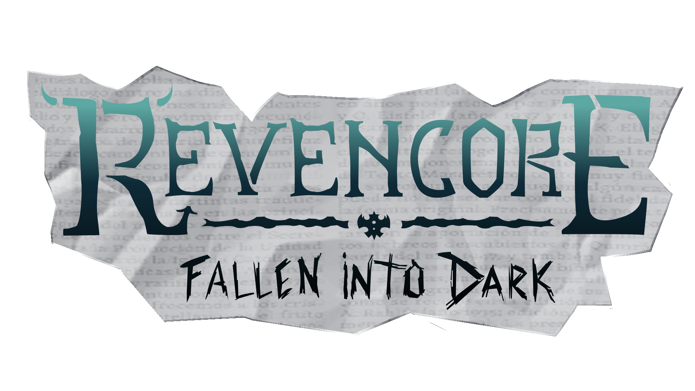

# Revencore: Fallen into Dark

Put yourself in the shoes of a brave exorcist and live an epic adventure in Revencore: Fallen into Dark, an intense and challenging beat ‘em up game.
Use your fists or throw knives to kill enemies and save the town of Aldenville. Walk around,, beat the monsters and search for potions that will help you in your journey.
The destiny of Aldenville is in your hands.
FEATURES
Free the people from evil with fights that will put you to the test in every scenario.
Find out the different types of attacks you can use against demons.
Face off against two types of enemies: Minions, who will melee you, and Spitter demons, who will throw hellish projectiles at you.
Get ready for the final showdown against the most powerful and evil boss you've ever seen.

This is a game being developed by students from <a href="https://www.imagecampus.edu.ar/">Image Campus</a>

   

## Credits

- **Godoy Tobias** - *Programming*
- **Otranto Dario** - *Programming*
- **Genero Anastasia** - *Art*
- **Leech Jules** - *Art*
- **Mejia Pablo** - *Art*
- **Clementino Ary** - *Audio*
- **Goizueta Felipe** - *Audio*
- **Navarro AzurmendiIgnacio** - *Audio*
- **Duran Federico** - *Testing*
- **Fernandez Gordano M. Florencia** - *Testing*
- **Lasdica Ignacio Benjamin** - *Testing*
- **Nervi Maximiliano Ariel** - *Testing*

This game was also possible thanks to the support of these professors:

- **Sergio Baretto**
- **Juan Pablo Varela Aloisio**
- **Ramiro Cabrera**
- **Eugenio Taboada**
- **Nazareno Rivero**
- **Lucía Inés Patetta**

## Acknowledgements

- **Federico Barra**
- **Franco Guerra**
- **Silvina Lemos Hoffmann**
- **Font "NoScary" By Linafis Studio. https://www.dafont.com/noscary.font**
- **Background “FREE Parallax Forest Background HQ” by Digital Moons. https://assetstore.unity.com/packages/2d/environments/free-parallax-forest-background-hq-158680**
- **Skybox "Customizable skybox" by Key Mouse Studio. https://assetstore.unity.com/packages/2d/textures-materials/sky/customizable-skybox-174576**

## Links

Download it from itch.io: https://tgodd.itch.io/revencore
